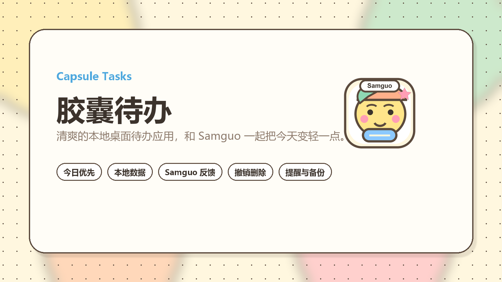
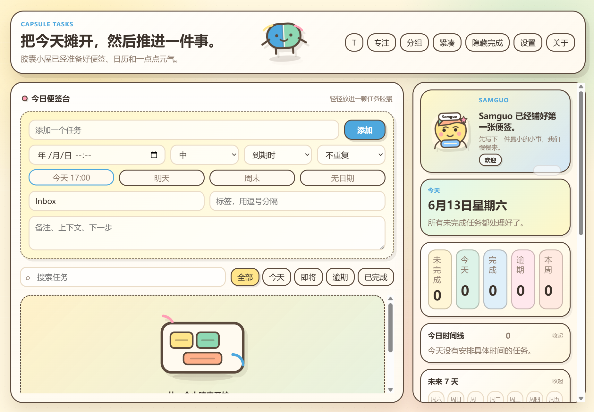
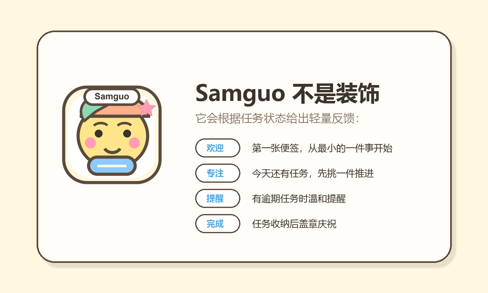

# 胶囊待办 Capsule Tasks

[中文](README.md) | [English](README.en.md)



胶囊待办是一款清爽的本地桌面待办应用。它不追求复杂的项目管理系统，而是帮助你打开应用后立刻看见今天最值得推进的事情。

应用内置 Samguo 卡通形象，会根据任务状态给出轻量反馈：欢迎、专注、提醒、完成。它让待办软件多一点陪伴感，但不会打扰你的工作流。

## 预览





## 适合谁

- 想要一个本地保存数据的桌面待办工具。
- 希望打开应用后优先看到今天、逾期、置顶和高优先级任务。
- 喜欢清爽但有一点卡通温度的个人效率工具。
- 不想把一个简单待办软件用成复杂项目管理系统。

## 主要特性

- **今日优先视图**：默认将逾期、今天、置顶、高优先级和未来一周任务自然靠前。
- **本地数据保存**：使用 `electron-store` 保存任务和设置，数据留在本机。
- **Samguo 陪伴反馈**：根据空列表、逾期、今日任务、完成状态切换文案和色调。
- **完成盖章动效**：完成任务时显示“已收纳”贴纸印章。
- **删除可撤销**：误删任务后可以从 toast 中撤销恢复。
- **智能输入**：支持 `今天`、`明天`、`周末`、`高`、`中`、`低`、`#标签`、`project:项目名`。
- **提醒与托盘**：支持到期提醒、托盘常驻、快速打开和快速新增。
- **导入导出与备份**：支持 JSON 导入/导出、自动备份和备份恢复。
- **中文界面**：界面文案、空状态、设置和反馈均为中文。

## 设计取向

胶囊待办的目标不是“大而全”，而是让核心路径足够顺：

```text
打开应用 -> 看见今天要做什么 -> 快速添加 -> 完成并收纳
```

因此，低频功能会尽量收进侧栏或设置里，主界面优先服务今日任务。

## 快速开始

安装依赖：

```bash
npm install
```

开发运行：

```bash
npm run start
```

打包 Windows 安装包：

```bash
npm run dist
```

打包产物会生成在 `release/` 目录中。

## 技术栈

- Electron
- JavaScript / HTML / CSS
- electron-store
- electron-builder

## 项目结构

```text
src/
  main.js                    Electron 主进程、存储、托盘、通知、IPC
  preload.js                 安全桥接，暴露 window.capsule
  tray-icon.png              Windows 托盘图标
  renderer/
    index.html               界面结构
    styles.css               视觉样式和动效
    renderer.js              渲染层状态和交互
    assets/                  Samguo 与空状态插画
scripts/
  patch-win-icon.js          Windows exe 图标资源修补脚本
docs/
  assets/                    README 展示图
```

## 版本

当前版本：`1.1.0`

更多变更见 [CHANGELOG.md](CHANGELOG.md)。

## License

[ISC](LICENSE)
